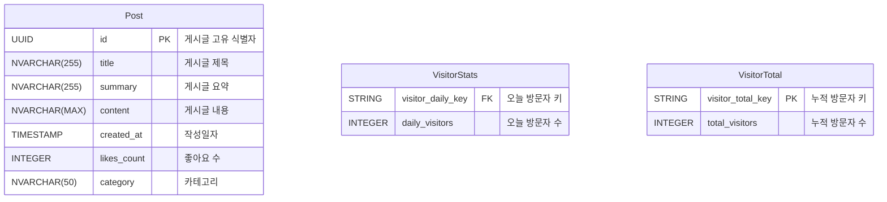

# Bang

```mermaid
erDiagram
    Post {
        UUID id PK "게시글 고유 식별자"
        NVARCHAR(255) title "게시글 제목"
        NVARCHAR(255) summary "게시글 요약"
        NVARCHAR(MAX) content "게시글 내용"
        TIMESTAMP created_at "작성일자"
        INTEGER likes_count "좋아요 수"
        NVARCHAR(50) category "카테고리"
    }

    VisitorStats {
        STRING visitor_daily_key FK "오늘 방문자 키" 
        INTEGER daily_visitors "오늘 방문자 수"
    }

    VisitorTotal {
        STRING visitor_total_key PK "누적 방문자 키"
        INTEGER total_visitors "누적 방문자 수"
    }
```