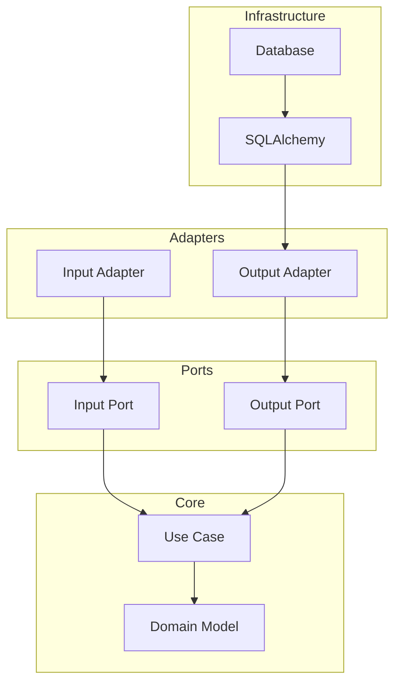
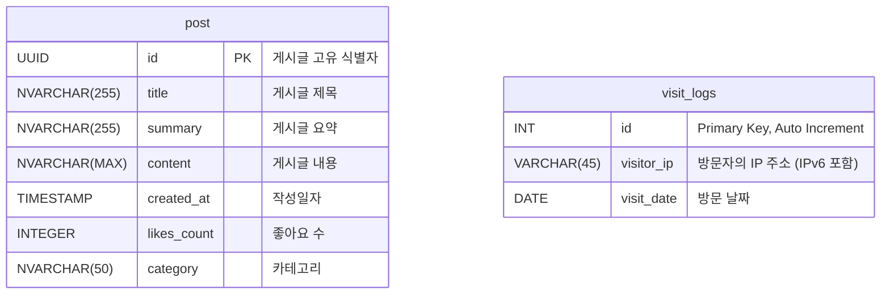

# Bang

## 프로젝트 소개
**Bang**은 저만의 커리어를 효과적으로 기록하고 공유하기 위해 기획된 개인 프로젝트입니다. 이 Repository는 Bang의 서버 소스 코드가 저장된 공간으로, 프로젝트의 핵심 로직과 구조를 담고 있습니다.

이 프로젝트에서는 비즈니스 로직 보호와 코드 유지보수성을 극대화하기 위해 Hexagonal Architecture를 학습하고 직접 설계하여 적용하였습니다. 또한, 데이터베이스 설계 역시 전 과정에서 직접 주도하여 설계하였으며, 효율성과 확장성을 고려한 구조를 구현하였습니다. 이러한 결정이 오버엔지니어링이라는 것은 인지하고 있지만, 헥사고날 아키텍처를 학습하고 직접 설계, 적용하는 과정에서 헥사고날 아키텍처에 대한 이해도를 높일 수 있었고, 헥사고날 아키텍처의 본질을 이해하는데 한걸음 나아갔다고 생각합니다.

Bang의 목표는 다음과 같습니다

- 제 커리어와 경험을 기록하여 개인적인 성장을 시각적으로 보여주는 공간을 제공합니다.
- 블로그 글과 기록을 통해 다른 사람들에게 인사이트와 영감을 주는 플랫폼으로 활용합니다.
- 최신 기술을 학습하고 이를 실무적으로 적용함으로써 기술적 역량을 강화합니다.
  
이 프로젝트를 통해 단순한 기록을 넘어, 개발자로서의 여정과 배움을 공유하고, 서로 성장할 수 있는 발걸음이 되길 희망합니다.

## 아키텍처 설계

Bang의 아키텍처는 **Alistair Cockburn**이 제안한 **Hexgonal Architecture**를 참고하여 적용하였습니다. 최대한 Hexgonal Architecture의 본질에 다가가려고 노력하였습니다.

### 계층 분리
Bang의 Hexgonal Architecture는 4가지 계층으로 구성되어있습니다. 
1. **Core(코어)**:
    - 도메인 모델과 UseCase로 구성되며, 비즈니스 로직의 중심입니다.
    - 외부 시스템의 구현 세부 사항에 의존하지 않으며, 애플리케이션의 핵심 규칙과 동작을 정의합니다.
2. **Ports(포트)**:
    - 비즈니스 로직과 외부 시스템 간의 통신 인터페이스를 정의합니다.
    - 코어가 외부 의존성과 직접 결합되지 않도록 추상화 계층을 제공합니다.
3. **Adapters(어댑터)**:
    - 포트를 구현하여 외부 시스템과 실제로 상호작용합니다.
    - 입력 어댑터는 외부 요청을 받아 입력 포트를 호출하고, 출력 어댑터는 출력 포트를 구현하여 외부 시스템과 통신합니다.
4. **Infrastructure(외부 시스템)**:
    - 데이터베이스, 외부 API, 메시지 브로커 등 외부에 존재하는 모든 시스템을 포함합니다.

### 의존성 방향
Hexagonal Architecture의 주요 원칙 중 하나인 "의존성은 항상 외부에서 내부로 향해야 한다."를 지키기 위해 의존성을 다음과 같이 설계하였습니다.

**단, 이는 소스코드 의존성이지 실행흐름과는 관련이 없습니다.**

## 데이터베이스 설계

## Contributing
만약 이 프로젝트에 기여하고 싶다면 언제든지 PR(Pull Request)을 보내주세요!   
또한, Issue를 통해 버그를 제보하거나 제안을 남길 수도 있습니다. :)

## Contact
프로젝트에 대한 질문이나 제안이 있다면 아래로 연락해주세요:

- Email: [nbhyun0329@gmail.com](mailto:nbhyun0329@gmail.com)